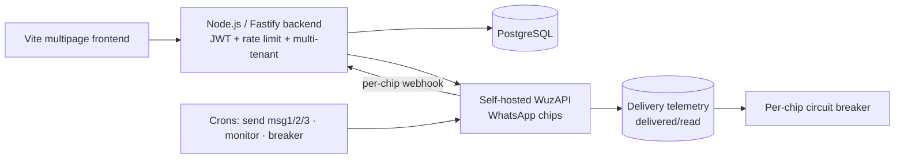

# Dispara-Zap — WhatsApp Campaign SaaS (multi-tenant)

🇧🇷 [Português](dispara-zap.md) | 🇬🇧 **English** · [← back](../README.en.md)

## Business problem
Businesses doing WhatsApp outreach need to run **cadenced** campaigns (follow-ups), **without getting numbers banned**, with each client **isolated** from the others and **LGPD**-compliant. Doing it by hand is unfeasible, risky and doesn't scale.

## Technical solution
A **multi-tenant** SaaS where each account manages its own numbers ("chips") and campaigns:
- Campaigns with a **cadence of up to 3 messages** (configurable delays), spintax/variations, images and buttons.
- CSV contact upload (with consent/LGPD), **auto-reply**, **opt-out** and reports.
- **Multi-chip** per campaign (fixed / random / round-robin) and lead notifications to a group.
- **Whitelabel** (one install per partner) with an admin panel.

## Architecture

## Stack
`Node.js` · `Fastify` · `Vite (multipage)` · `PostgreSQL` · `WuzAPI (WhatsApp)` · `JWT` · `Docker` · cron jobs

## Engineering highlights
- **Hardened multi-tenancy:** per-`user_id` isolation at the data gateway, *force-owner*, and **tenant-scoped webhooks**. A module-by-module audit fixed **IDOR, SQL injection, SSRF and privilege escalation**.
- **Telemetry-driven anti-ban:** per-chip delivery receipts (delivered/read) → a **circuit breaker** that pauses a number when delivery collapses (hard signal) or drops vs. the chip's own baseline; per-chip **rate-limiter** and **warmup** for new numbers.
- **Resilient cadence:** single send engine with a **per-stage/campaign lock** (no bursts/duplicates) and transient-failure retry.
- **BYOK AI:** each user brings their own key (Gemini/OpenAI/Anthropic), **encrypted and isolated**, to generate message variations.
- **LGPD:** opt-out, transactional account deletion, data portability (export) and data minimization.

## Result
- **In production** (whitelabel model), with campaign cadence **validated end to end**.
- Number fleet **instrumented** (delivery/read) and self-protected against bans.
- Multi-tenant base **audited** module by module for security and isolation.

> Note: bulk messaging requires responsible use and compliance with WhatsApp policies and data-protection law.
