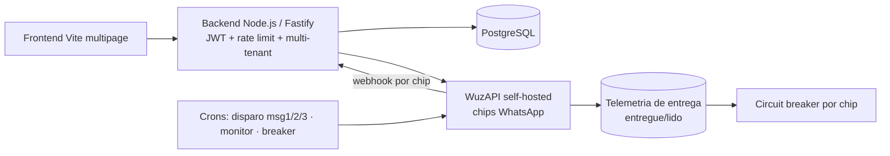

# Dispara-Zap — Plataforma SaaS de Campanhas WhatsApp (multi-tenant)

🇧🇷 **Português** | 🇬🇧 [English](dispara-zap.en.md) · [← voltar](../README.md)

## Problema de negócio
Negócios que prospectam por WhatsApp precisam disparar campanhas com **cadência** (follow-ups), **sem tomar ban** dos números, com cada cliente **isolado** dos demais e em conformidade com a **LGPD**. Fazer na mão é inviável, arriscado e não escala.

## Solução técnica
SaaS **multi-tenant** onde cada conta gerencia seus próprios números ("chips") e campanhas:
- Campanhas com **cadência de até 3 mensagens** (delays configuráveis), variações/spintax, imagens e botões.
- Upload de contatos por CSV (com consentimento/LGPD), **auto-reply**, **opt-out** e relatórios.
- **Multi-chip** por campanha (fixo / aleatório / round-robin) e notificação de leads em grupo.
- **Whitelabel** (1 instalação por parceiro) com painel administrativo.

## Arquitetura

## Stack
`Node.js` · `Fastify` · `Vite (multipage)` · `PostgreSQL` · `WuzAPI (WhatsApp)` · `JWT` · `Docker` · cron jobs

## Destaques de engenharia
- **Multi-tenancy endurecido:** isolamento por `user_id` no gateway de dados, *force-owner* e webhook **escopado por tenant**. Auditoria módulo a módulo corrigiu **IDOR, SQL injection, SSRF e escalada de privilégio**.
- **Anti-ban orientado a telemetria:** captura de recibos (entregue/lido) por chip → **circuit breaker** que pausa o número quando a entrega colapsa (sinal duro) ou cai vs. o baseline do próprio chip; **rate-limiter** por chip e **warmup** de números novos.
- **Cadência resiliente:** motor único de disparo com **lock por etapa/campanha** (sem rajada/duplicata) e retry de falha transitória.
- **BYOK de IA:** cada usuário usa a própria chave (Gemini/OpenAI/Anthropic), **criptografada e isolada**, para gerar variações de mensagem.
- **LGPD:** opt-out, exclusão de conta em transação, portabilidade (export) e minimização de dados.

## Resultado
- Em **produção** (modelo whitelabel), com cadência de campanha **validada ponta a ponta**.
- Frota de números **instrumentada** (entrega/leitura) e auto-protegida contra ban.
- Base multi-tenant **auditada** módulo a módulo em segurança e isolamento.

> Nota: mensageria em massa exige uso responsável e conformidade com as políticas do WhatsApp e a LGPD.
