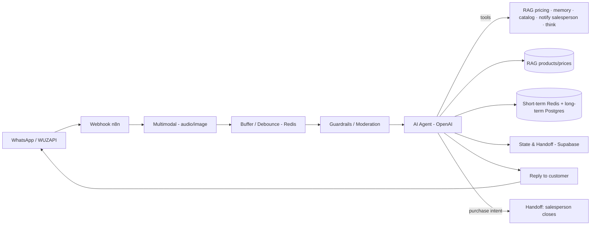

# EVA — B2B Sales Agent (Dental Supplies)

🇧🇷 [Português](eva.md) | 🇬🇧 **English** · [← back](../README.en.md)

## Business problem
A **dental supplies (endodontics)** store/distributor serves dentists over WhatsApp. Quoting each product's price, assembling the order and routing to the salesperson manually is slow and error-prone. The customer is a **professional** who wants speed and accurate pricing — no fluff and no "guessed" values.

## Technical solution
A **B2B** AI WhatsApp assistant ("EVA") that:
- Understands **text, audio and image**.
- Looks up prices and products via **RAG** (knowledge base) — **never invents a value**.
- **Assembles the order** as the customer picks items.
- Sends **catalog/product images** (Google Drive).
- **Hands off to a human salesperson** to close — by design, the AI does not close sales, negotiate discounts or confirm delivery times.
- Keeps short- + long-term memory and a moderation layer.

## Architecture

## Stack
`n8n` · `OpenAI` · `WUZAPI (WhatsApp)` · `Supabase / PostgreSQL` · `Redis` · `Google Drive` · `RAG` · `LangChain Guardrails`

## Engineering highlights
- **Product/price RAG** — answers faithful to the knowledge base, no value hallucination (critical in a sales context).
- **Explicit responsibility scope** — the AI qualifies and assembles the order; a human closes the sale. Clear, safe handoff.
- **Multimodal** — understands audio and image in addition to text.
- **Moderation layer (guardrails)** + short-term (Redis) and long-term (PostgreSQL summary) memory.
- **On-demand visual catalog** — sends product images from Google Drive.

## Result
- **In production**, serving professionals (dentists) 24/7 on WhatsApp.
- **Automatic** quoting and order assembly, with prices always sourced from the knowledge base (RAG).
- Structured handoff to the salesperson to close the deal.
- *Quantitative metrics (orders assembled, conversion) can be added by the project owner.*
