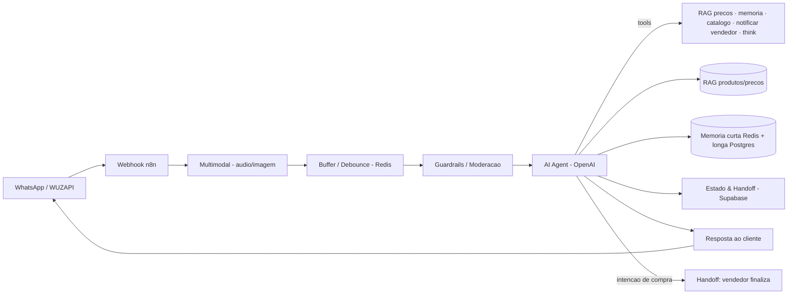

# EVA — Agente de Vendas B2B (Materiais Odontológicos)

🇧🇷 **Português** | 🇬🇧 [English](eva.en.md) · [← voltar](../README.md)

## Problema de negócio
Uma loja/distribuidora de **materiais odontológicos (endodontia)** atende dentistas pelo WhatsApp. Responder o preço de cada produto, montar o pedido e encaminhar para o vendedor manualmente é lento e sujeito a erro. O cliente é um **profissional** que quer rapidez e preço preciso — sem enrolação e sem valor "chutado".

## Solução técnica
Assistente de IA de atendimento **B2B** no WhatsApp ("EVA") que:
- Entende **texto, áudio e imagem**.
- Consulta preços e produtos via **RAG** (base de conhecimento) — **nunca inventa valor**.
- **Monta o pedido** conforme o cliente escolhe os itens.
- Envia **imagens de catálogo/produto** (Google Drive).
- **Transfere para o vendedor humano** finalizar — por escopo, a IA não fecha venda, não negocia desconto e não confirma prazo.
- Mantém memória curta + longa e uma camada de moderação.

## Arquitetura

## Stack
`n8n` · `OpenAI` · `WUZAPI (WhatsApp)` · `Supabase / PostgreSQL` · `Redis` · `Google Drive` · `RAG` · `LangChain Guardrails`

## Destaques de engenharia
- **RAG de preços/produtos** — respostas fiéis à base de conhecimento, sem alucinação de valor (crítico num contexto de venda).
- **Escopo de responsabilidade explícito** — a IA qualifica e monta o pedido; a venda é fechada por um humano. *Handoff* claro e seguro.
- **Multimodal** — entende áudio e imagem além de texto.
- **Camada de moderação (guardrails)** + memória curta (Redis) e longa (resumo em PostgreSQL).
- **Catálogo visual sob demanda** — envio de imagens de produto a partir do Google Drive.

## Resultado
- Em **produção**, atendendo profissionais (dentistas) 24/7 no WhatsApp.
- Cotação e montagem de pedido **automáticas**, com preço sempre vindo da base (RAG).
- *Handoff* estruturado para o vendedor fechar a venda.
- *Métricas quantitativas (pedidos montados, conversão) podem ser adicionadas pelo dono do projeto.*
