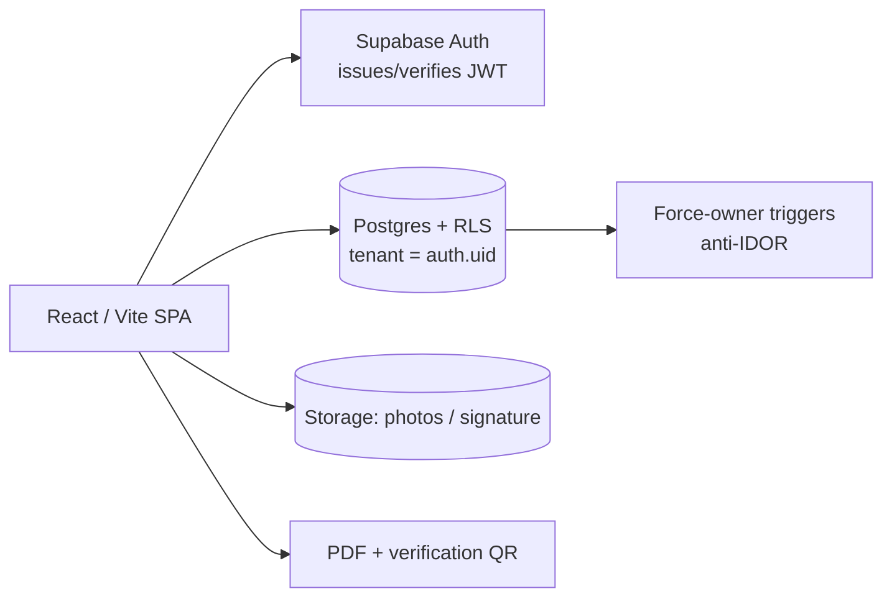

# ICA Avaliações — Multi-tenant Appraisal-Report SPA (Supabase RLS)

🇧🇷 [Português](ica-avaliacoes.md) | 🇬🇧 **English** · [← back](../README.en.md)

## Business problem
Technical evaluators need to issue **appraisal reports** (with photos, signature, stamp and sequential numbering), each seeing **only their own**, with an **admin** who sees everything — and generate a PDF with a **verification QR**. Without proper isolation, one evaluator would see another's data (leak / data-protection risk).

## Technical solution
An SPA (React/Vite) that talks **directly to Supabase** (no backend), with **per-evaluator multi-tenancy** via **RLS**:
- Isolation by `auth.uid()` — the tenant comes from the **JWT verified in Postgres**, never from the front end.
- **Force-owner triggers** (the owner is stamped server-side → closes IDOR).
- Report **PDF** generation + **verification QR**; photos/signature in Storage.
- Per-municipality sequential numbering via a **`SECURITY DEFINER` RPC**.

## Architecture

## Stack
`React` · `Vite` · `TypeScript` · `Supabase (Postgres + RLS + Auth + Storage)` · `Vercel`

## Engineering highlights
- **Isolation via pure RLS** (no backend): "the tenant id comes from the server-verified JWT, never from the front" — RLS + force-owner triggers + no write policy = blocked.
- **Anti-IDOR on child tables** (photos inherit the parent report's scope).
- **Isolation acceptance tests** (A can't see B · IDOR blocked · insert forcing another's owner is rewritten · broad delete doesn't touch others) — **all passed**.
- **Fixed Supabase security advisors** (mutable `search_path`, always-true policy, sensitive function exposed via RPC).
- Careful with **RLS recursion** (`SECURITY DEFINER` helpers + a deliberate choice not to use `FORCE RLS`).

## Result
- **In production** (Vercel + Supabase), per-evaluator multi-tenancy **applied and tested**.
- Report issuance with PDF + verification QR, with **isolation guaranteed at the database** (not just the UI).
