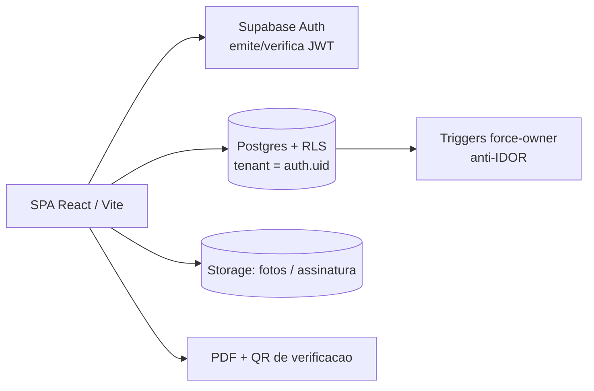

# ICA Avaliações — SPA Multi-tenant de Pareceres (Supabase RLS)

🇧🇷 **Português** | 🇬🇧 [English](ica-avaliacoes.en.md) · [← voltar](../README.md)

## Problema de negócio
Avaliadores técnicos precisam emitir **pareceres/laudos** (com fotos, assinatura, carimbo e numeração sequencial), cada um vendo **apenas os seus**, com um **admin** que vê tudo — e gerar PDF com **QR de verificação**. Sem isolamento correto, um avaliador veria dados de outro (vazamento / risco LGPD).

## Solução técnica
SPA (React/Vite) que fala **direto com o Supabase** (sem backend), com **multi-tenancy por avaliador** via **RLS**:
- Isolamento por `auth.uid()` — o tenant vem do **JWT verificado no Postgres**, nunca do front.
- **Triggers force-owner** (o dono é carimbado no servidor → fecha IDOR).
- Geração de **PDF** do parecer + **QR de verificação**; fotos/assinatura em Storage.
- Numeração sequencial por município via **RPC `SECURITY DEFINER`**.

## Arquitetura

## Stack
`React` · `Vite` · `TypeScript` · `Supabase (Postgres + RLS + Auth + Storage)` · `Vercel`

## Destaques de engenharia
- **Isolamento por RLS puro** (sem backend): "o id do tenant vem do JWT verificado no servidor, nunca do front" — RLS + triggers force-owner + ausência de policy de escrita = bloqueio.
- **Anti-IDOR em tabelas filhas** (fotos herdam o escopo do parecer pai).
- **Testes de aceite de isolamento** (A não vê B · IDOR bloqueado · insert forçando dono alheio é reescrito · delete amplo não afeta terceiros) — **todos passaram**.
- **Correção de advisors de segurança do Supabase** (`search_path` mutável, policy sempre-verdadeira, função sensível exposta via RPC).
- Cuidado com **recursão de RLS** (helpers `SECURITY DEFINER` + decisão consciente de não usar `FORCE RLS`).

## Resultado
- Em **produção** (Vercel + Supabase), multi-tenant por avaliador **aplicado e testado**.
- Emissão de pareceres com PDF + QR de verificação, com **isolamento garantido no banco** (não só na UI).
