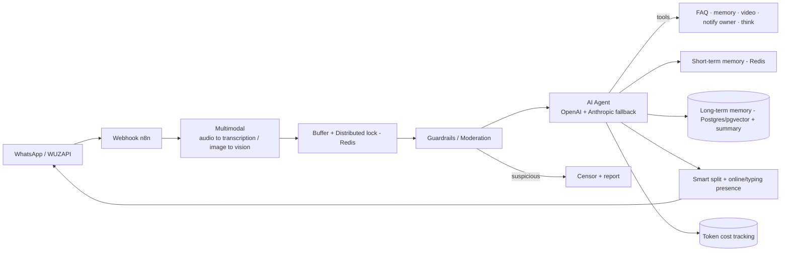

# Nina — Multimodal Lead Agent (Tattoo Studio)

🇧🇷 [Português](nina.md) | 🇬🇧 **English** · [← back](../README.en.md)

## Business problem
A tattoo studio receives many WhatsApp leads — in **text, audio and reference photos**. Qualifying each lead, answering recurring questions, showing the portfolio and filtering out suspicious contacts takes a lot of time, and it isn't always possible to reply right away.

## Technical solution
A multimodal assistant ("Nina") that:
- Understands **text, audio (transcription) and image (vision)**.
- Qualifies the lead, answers FAQ and delivers **portfolio videos** on demand (from Google Drive).
- Applies a **security/moderation layer** that censors and reports suspicious leads before they reach the agent.
- Keeps **short-term memory** (conversation) and **long-term memory** (AI summary in a vector store).
- **Notifies the owner** and escalates to human service.
- **Tracks token cost** per conversation.

## Architecture

## Stack
`n8n` · `OpenAI (+ Anthropic fallback)` · `WUZAPI (WhatsApp)` · `Supabase + PostgreSQL/pgvector` · `Redis` · `Google Drive` · `LangChain Guardrails`

## Engineering highlights
- **Distributed lock (Redis) for debounce** — concatenates burst messages and avoids duplicate/concurrent replies within a conversation.
- **Moderation guardrails** — classifies and blocks/reports suspicious leads before spending the agent.
- **Multi-LLM fallback** — OpenAI as primary and Anthropic as backup on the same agent, improving availability.
- **Long-term memory** — automatic conversation summary persisted in a vector store and resumed on new interactions.
- **Human-like presence** — "online/typing" status and splitting the reply into short, natural messages.
- **Cost observability** — computes and records token cost per interaction.

## Result
- **In production**, serving real leads 24/7 across multiple formats (text/audio/image).
- Automatic triage and FAQ; portfolio delivered on demand; suspicious leads filtered automatically.
- Per-conversation cost visibility.
- *Quantitative metrics can be added by the project owner.*
