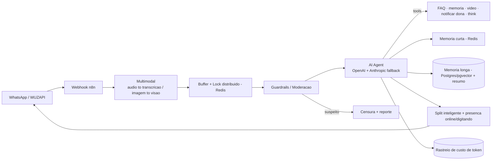

# Nina — Agente Multimodal de Leads (Estúdio de Tatuagem)

## Problema de negócio
Um estúdio de tatuagem recebe muitos leads no WhatsApp — em **texto, áudio e fotos de referência**. Qualificar cada lead, responder dúvidas recorrentes, mostrar portfólio e filtrar contatos suspeitos consome muito tempo, e nem sempre dá para responder na hora.

## Solução técnica
Assistente multimodal ("Nina") que:
- Entende **texto, áudio (transcrição) e imagem (visão)**.
- Qualifica o lead, responde FAQ e envia **vídeos de portfólio** sob demanda (do Google Drive).
- Aplica uma **camada de segurança/moderação** que censura e reporta leads suspeitos antes de chegar ao agente.
- Mantém **memória curta** (da conversa) e **memória longa** (resumo por IA em banco vetorial).
- **Notifica a dona** e escala para atendimento humano.
- **Rastreia o custo de tokens** por conversa.

## Arquitetura

## Stack
`n8n` · `OpenAI (+ Anthropic fallback)` · `WUZAPI (WhatsApp)` · `Supabase + PostgreSQL/pgvector` · `Redis` · `Google Drive` · `LangChain Guardrails`

## Destaques de engenharia
- **Lock distribuído (Redis) para *debounce*** — concatena mensagens enviadas em rajada e evita respostas duplicadas/concorrentes numa mesma conversa.
- **Guardrails de moderação** — classifica e barra/reporta leads suspeitos antes de consumir o agente.
- **Fallback multi-LLM** — OpenAI como primário e Anthropic como reserva no mesmo agente, aumentando disponibilidade.
- **Memória de longo prazo** — resumo automático da conversa persistido em banco vetorial e retomado em novas interações.
- **Presença humanizada** — status "online/digitando" e divisão da resposta em mensagens curtas e naturais.
- **Observabilidade de custo** — cálculo e registro do custo de tokens por atendimento.

## Resultado
- Em **produção**, atendendo leads reais 24/7 em múltiplos formatos (texto/áudio/imagem).
- Triagem e FAQ automáticas; portfólio entregue sob demanda; leads suspeitos filtrados automaticamente.
- Visibilidade de custo por conversa.
- *Métricas quantitativas podem ser adicionadas pelo dono do projeto.*
