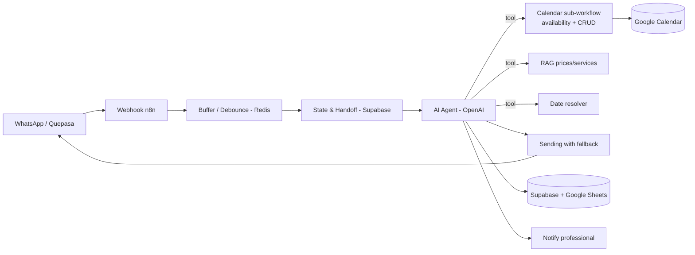

# Priscila — Booking Agent (Barbershop)

🇧🇷 [Português](priscila.md) | 🇬🇧 **English** · [← back](../README.en.md)

## Business problem
A barbershop manages bookings manually over WhatsApp. The owner wastes time replying, makes scheduling mistakes and loses customers when replies are slow. Customers want to **book, reschedule or cancel in seconds, at any time**.

## Technical solution
An AI WhatsApp assistant ("Priscila") that runs the whole interaction end-to-end:
- Detects intent (book / reschedule / cancel / pricing / question).
- Searches free slots in Google Calendar **considering the service duration**.
- Books, reschedules and cancels by creating/moving calendar events.
- Answers prices and services via **RAG** — never inventing values.
- Logs bookings to a database (Supabase) and a spreadsheet (Google Sheets).
- Notifies the professional in a group and **hands off to a human** when needed.

## Architecture

## Stack
`n8n` · `OpenAI` · `Quepasa (WhatsApp)` · `Supabase / PostgreSQL` · `Redis` · `Google Calendar` · `Google Sheets` · `RAG`

## Engineering highlights
- **Deterministic date resolver** — LLMs get "today/tomorrow/Monday" wrong. Date math was moved to a code tool (`America/Sao_Paulo` timezone), with a guard that rejects past dates. See [`snippet`](../snippets/resolver-data-deterministico.js).
- **Duration-aware slot search** — offered slots respect the real service duration (haircut 30 min, haircut + beard 60 min) and business hours. See [`snippet`](../snippets/busca-horarios-duracao.js).
- **Robust rescheduling** — locates the event by its **original date/time** (not by name, which is fragile) and handles "not found" with a useful reply instead of failing silently.
- **Resilient delivery** — normalized WhatsApp number + fallback path when delivery fails, covering number-format variations.

## Result
- **In production, 24/7**, serving real customers on WhatsApp.
- **Automatic** booking, rescheduling and cancellation, with no owner intervention.
- Less manual work and fewer scheduling errors, while preserving human handoff.
- *Quantitative metrics (volume, conversion) can be added by the project owner.*
