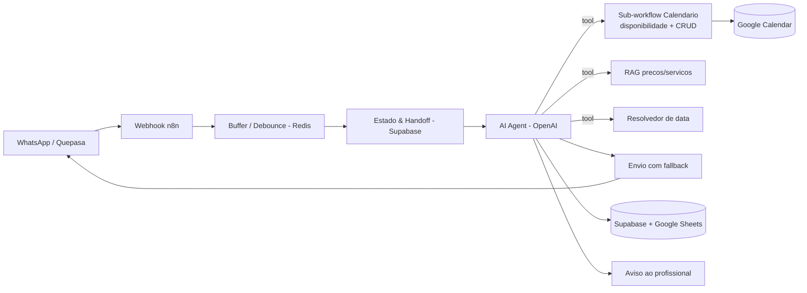

# Priscila — Agente de Agendamento (Barbearia)

## Problema de negócio
Uma barbearia gerencia agendamentos manualmente pelo WhatsApp. O dono perde tempo respondendo, comete erros de agenda e perde clientes quando não responde rápido. O cliente quer **marcar, remarcar ou cancelar em segundos, a qualquer hora**.

## Solução técnica
Assistente de IA no WhatsApp ("Priscila") que conduz o atendimento de ponta a ponta:
- Identifica a intenção (agendar / reagendar / cancelar / preço / dúvida).
- Busca horários livres no Google Calendar **considerando a duração do serviço**.
- Agenda, reagenda e cancela criando/movendo eventos no calendário.
- Responde preços e serviços via **RAG** — sem inventar valores.
- Registra os agendamentos em banco (Supabase) e planilha (Google Sheets).
- Avisa o profissional em um grupo e **transfere para um humano** quando necessário.

## Arquitetura

## Stack
`n8n` · `OpenAI` · `Quepasa (WhatsApp)` · `Supabase / PostgreSQL` · `Redis` · `Google Calendar` · `Google Sheets` · `RAG`

## Destaques de engenharia
- **Resolvedor de data determinístico** — LLMs erram "hoje/amanhã/segunda". O cálculo foi movido para uma ferramenta em código (fuso `America/Sao_Paulo`), com *guard* que rejeita datas no passado. Ver [`snippet`](../snippets/resolver-data-deterministico.js).
- **Busca de horários ciente da duração** — os slots respeitam a duração real do serviço (corte 30 min, corte + barba 60 min) e o expediente. Ver [`snippet`](../snippets/busca-horarios-duracao.js).
- **Reagendamento robusto** — localiza o evento pela **data/hora original** (não por nome, que é frágil) e trata "não encontrado" com uma resposta útil em vez de falhar em silêncio.
- **Envio resiliente** — número de WhatsApp normalizado + caminho de *fallback* quando a entrega falha, cobrindo variações de formato de número.

## Resultado
- Em **produção, 24/7**, atendendo clientes reais no WhatsApp.
- Agendamento, reagendamento e cancelamento **automáticos**, sem intervenção do dono.
- Menos trabalho manual e menos erros de agenda, mantendo o *handoff* humano quando preciso.
- *Métricas quantitativas (volume de atendimentos, conversão) podem ser adicionadas pelo dono do projeto.*
