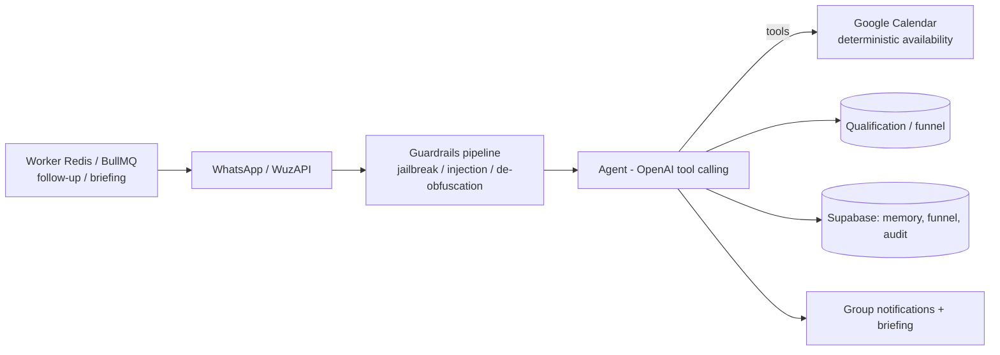

# SDR Previdenciário — Lead Qualification + Scheduling Agent (code-based)

🇧🇷 [Português](sdr-previdenciario.md) | 🇬🇧 **English** · [← back](../README.en.md)

## Business problem
A **social-security law firm** gets many WhatsApp leads, but not all are a fit. The lawyer wastes time on cold leads and **cannot** give automated legal advice. It needs to **qualify** (hot/warm/cold), **schedule only qualified leads**, and be pinged at the right moment.

## Technical solution
A **fully code-based** SDR agent (TypeScript, no low-code) on WhatsApp:
- **Qualifies** the lead (social-security area + score) and **blocks scheduling** for unqualified ones.
- **Schedules** on Google Calendar with **deterministic** availability (computed in code, not by the LLM).
- **Guardrails pipeline** running **before** the agent (anti-jailbreak, prompt-injection, prompt-leak, de-obfuscation).
- **Humanizes** the reply (short, 1 idea + 1 question, "reading/typing" delays).
- **Re-engagement** via queues (worker), group **notifications** + pre-meeting briefing, append-only **audit** and **natural-language analytics** over WhatsApp.

## Architecture

## Stack
`TypeScript` · `OpenAI (tool calling + prompt caching)` · `Supabase (Postgres + RLS)` · `WuzAPI (WhatsApp)` · `Google Calendar API` · `Redis + BullMQ` · `Docker Compose (VPS)`

## Engineering highlights
- **First-class guardrails:** a dedicated security pipeline BEFORE the agent (the system prompt never leaks; the agent never gives legal advice → escalates to the lawyer).
- **Qualification with scheduling gate** — only hot/qualified leads can book.
- **Deterministic availability** on Google Calendar (lesson inherited from Priscila: compute slots in code, respecting duration/business hours).
- **Natural-language analytics** (questions over WhatsApp → aggregated SQL + % change), restricted to authorized numbers.
- **Append-only audit** of everything (interactions, decisions, qualifications, human interventions).

## Result
- **In development (pre go-live):** backend, worker and schema implemented; remaining items are **environment** setup (credentials, Calendar OAuth, client parameters).
- A **code-based** architecture (not low-code) chosen on purpose: the critical parts — guardrails, audit and analytics — are more reliable and controllable this way.
