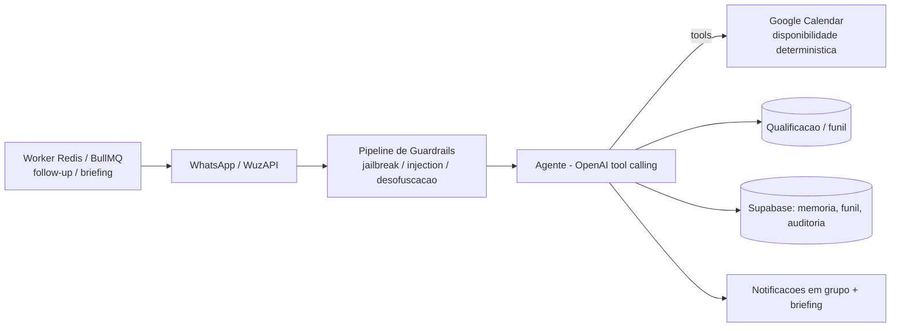

# SDR Previdenciário — Agente de Qualificação + Agendamento (em código)

🇧🇷 **Português** | 🇬🇧 [English](sdr-previdenciario.en.md) · [← voltar](../README.md)

## Problema de negócio
Um escritório de **advocacia previdenciária** recebe muitos leads no WhatsApp, mas nem todos têm perfil. O advogado perde tempo com leads frios e **não pode** dar parecer jurídico automático. Precisa **qualificar** (quente/morno/frio), **agendar só quem é qualificado** e ser acionado no momento certo.

## Solução técnica
Agente SDR **100% em código** (TypeScript, sem low-code) no WhatsApp:
- **Qualifica** o lead (área previdenciária + score) e **bloqueia agendamento** de quem não é qualificado.
- **Agenda** no Google Calendar com disponibilidade **determinística** (cálculo em código, não no LLM).
- **Pipeline de guardrails** de segurança **antes** do agente (anti-jailbreak, prompt-injection, vazamento de prompt, desofuscação).
- **Humaniza** a resposta (curta, 1 ideia + 1 pergunta, delays de "lendo/digitando").
- **Reengajamento** por filas (worker), **notificações** em grupo + briefing pré-reunião, **auditoria** append-only e **analytics em linguagem natural** via WhatsApp.

## Arquitetura

## Stack
`TypeScript` · `OpenAI (tool calling + prompt caching)` · `Supabase (Postgres + RLS)` · `WuzAPI (WhatsApp)` · `Google Calendar API` · `Redis + BullMQ` · `Docker Compose (VPS)`

## Destaques de engenharia
- **Guardrails first-class:** pipeline de segurança dedicado ANTES do agente (o system prompt nunca vaza; o agente nunca dá parecer jurídico → escala ao advogado).
- **Qualificação com bloqueio de agendamento** — só lead quente/qualificado consegue marcar.
- **Disponibilidade determinística** no Google Calendar (lição herdada da Priscila: cálculo de horário em código, respeitando duração/expediente).
- **Analytics em linguagem natural** (perguntas via WhatsApp → SQL agregada + variação %), só para números autorizados.
- **Auditoria append-only** de tudo (interações, decisões, qualificações, intervenções humanas).

## Resultado
- **Em desenvolvimento (pré go-live):** backend, worker e schema implementados; pendências são de **ambiente** (credenciais, OAuth do Calendar, parâmetros do cliente).
- Arquitetura **em código** (não low-code) escolhida de propósito: os pontos críticos — guardrails, auditoria e analytics — ficam mais confiáveis e controláveis assim.
